# Net 6 Code First Migration ASP.NET CORE 6 WEB API.

Creamos nuestro proyecto de ASP.NET CORE 6

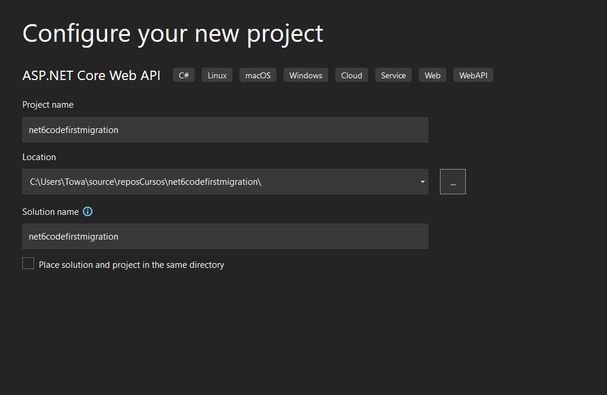

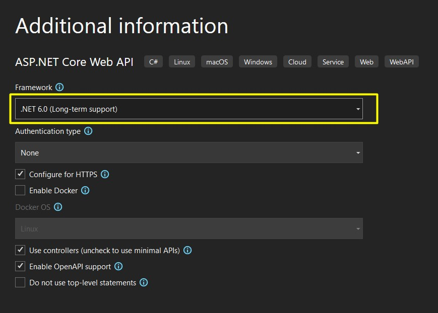

Procedemos a instalar en nuestro proyecto 2 paquetes nuggets

> - Microsoft.entityframeworkcore.sqlserver
> - Microsoft.EntityFrameworkCore.Tools

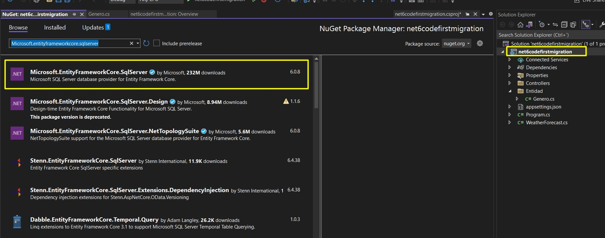

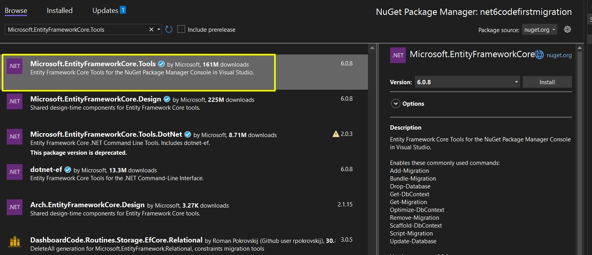

Agregamos nuestra primera tabla Genero

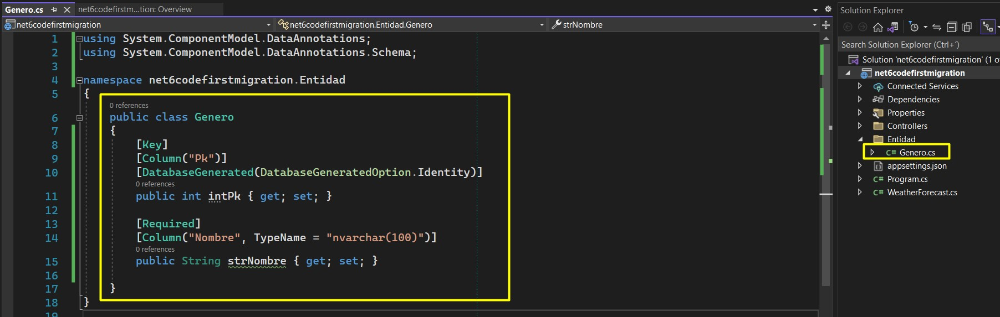

Configuramos nuestra cadena de conexion

```json
"ConnectionStrings": {
    "DefaultConnection": "Server=DESKTOP-ANEEUI8;Database=PeliculasApi;User=DBUser;Password=DBUser2019"
  }
```
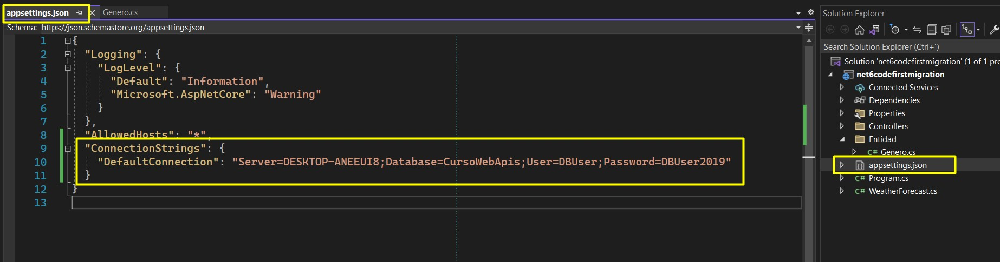

Creamos nuestro contexto

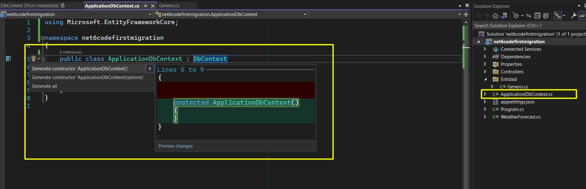

Configuramos nuestro contexto

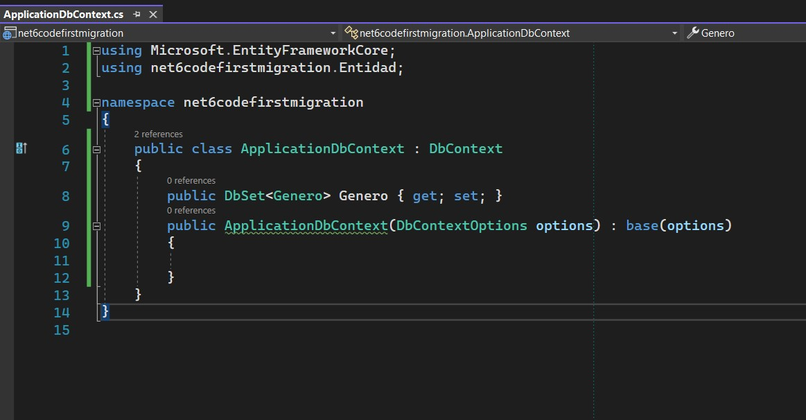

Configuramos nuestro Programa para versiones recientes
o startup para versiones inferiores a Net 6

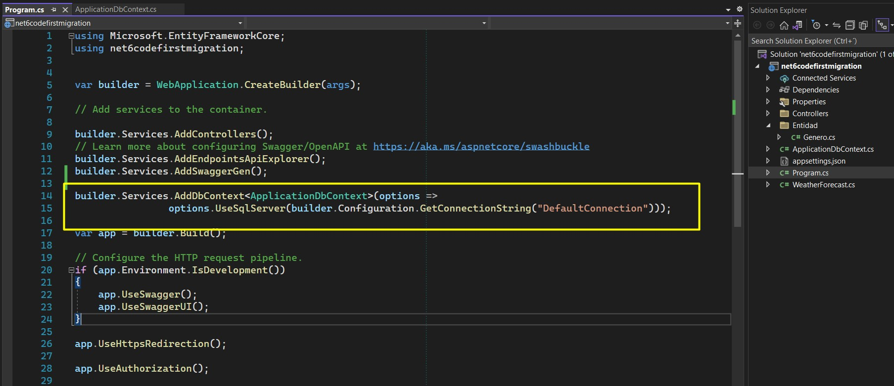


Procedemos a ejecutar comandos en la consola
de Nugget

> - ``Add-Migration Initial``
> * Lo que hace es que nos genera archivos para
crear la base de datos


> - ``Update-Database``
> * Me crea la base de datos si no existe, y si 
ya existe entonces la actualiza.


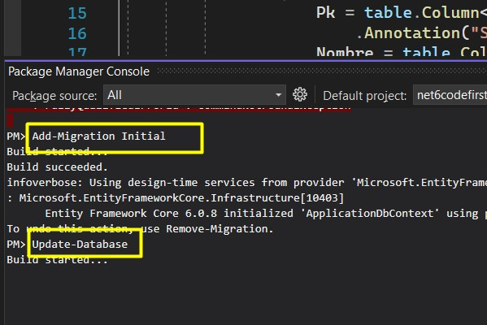

Vemos la base de datos creada

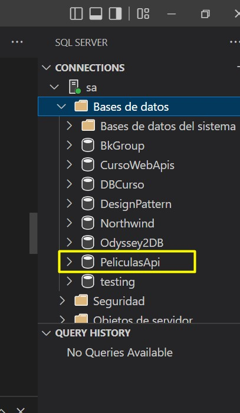


